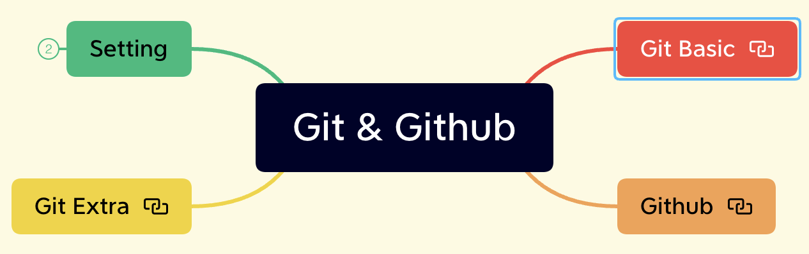
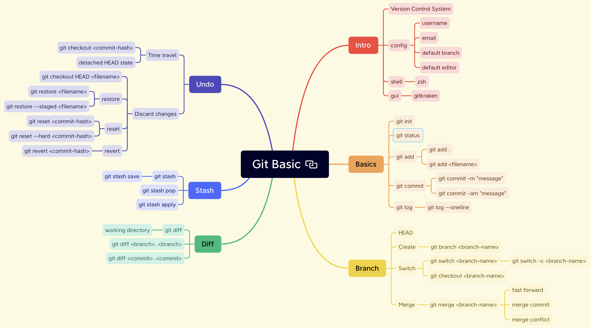
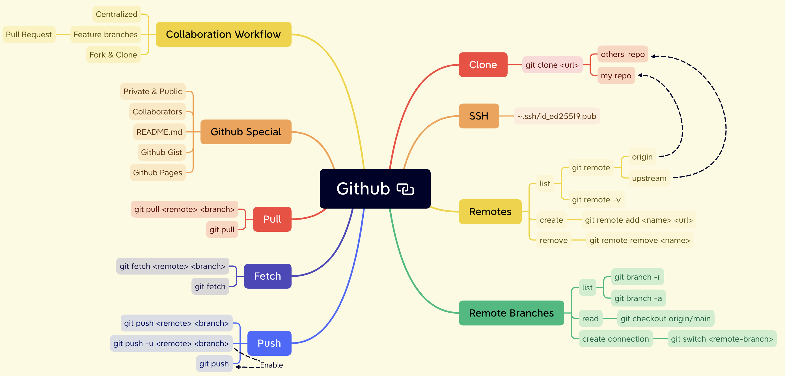
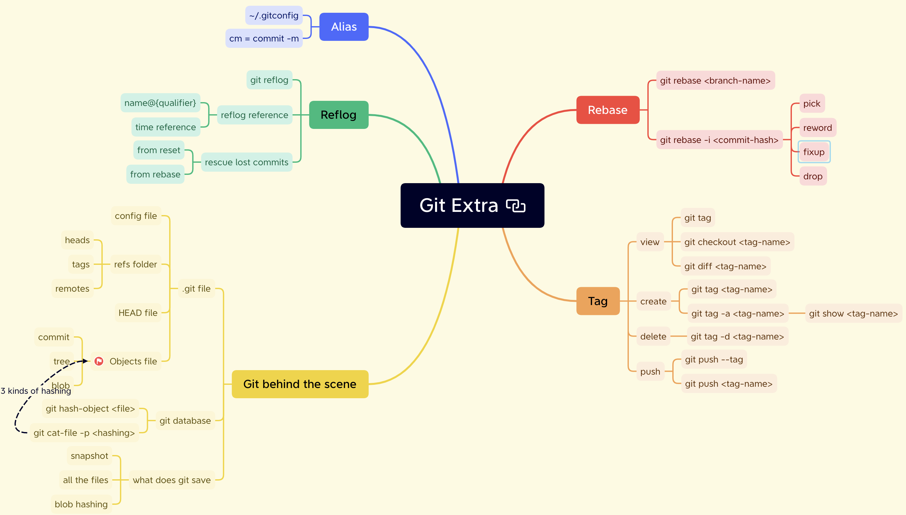

# Summary

## Git basic

## Github

## Git Extra

## Shortcuts

| Shortcuts      | Usage              |
| -------------- | ------------------ |
| command shit . | Show hiden files   |
|                |                    |
| Command K      | clear the terminal |

