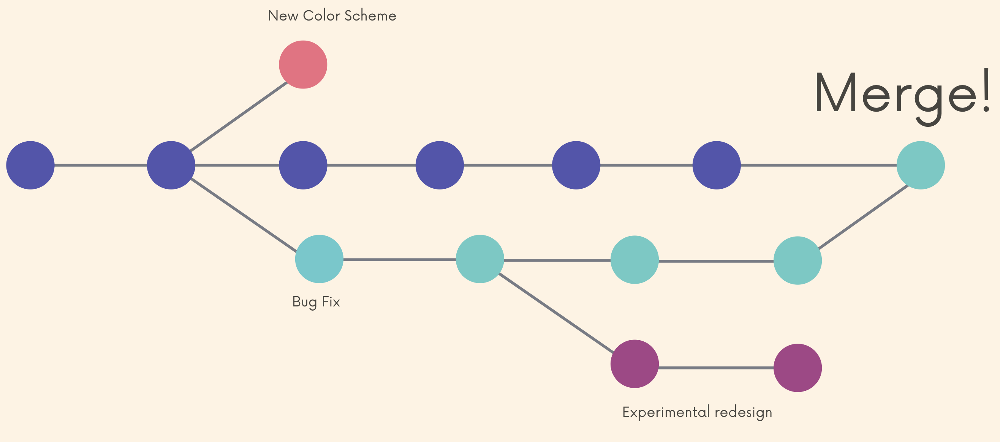

# Branches

Git branches are effectively **a pointer to a snapshot of your changes**.




### The master(main) branch

- The default branch name is master.
- Many people designate the master branch as their source of truth.
- In 2020, Github renamed the default branch from **master** to **main**

To change default branch name to `main`:

```shell
git config --global init.defaultBranch "main"
```


### HEAD

HEAD is simply a pointer that refers to the current location in your repository. It points to a particular branch reference.

```shell
2c4f2f2 (HEAD -> main) Some ds files ...
02d596f Add a picture
2276696 begin chapter 2
```


### View branch

##### `git branch`

View branches

`*` indicates the branch you are currently on

```shell
* main
  oldies
  recentish
```


### Create Branch

##### `git branch <branch-name>`

Make a new branch based upon the current HEAD.

It just creates the branch but does not switch to that branch.


### Switch between branches

##### `git switch <branch-name>`

##### `git switch -c <branch-name>`

- create and then switch

```shell
➜  RoadtripPlaylist git:(main) git branch oldies
➜  RoadtripPlaylist git:(main) git branch
➜  RoadtripPlaylist git:(main) git switch oldies
Switched to branch 'oldies'


commit c0c380a81b7831c8a5de67aa47fc140b522054eb (HEAD -> oldies)
Author: Josh Wang <leotwang@bu.edu>
Date:   Thu Sep 15 19:26:44 2022 -0400

    add two george jones songs

commit 6195be0660d3f49c07faf3eb89cf26984bb20317 (main)
Author: Josh Wang <leotwang@bu.edu>
Date:   Thu Sep 15 19:20:27 2022 -0400

    Add two ABBA songs
```

##### `git checkout <branch-name>`

- Similar to switch but do more things (old)

```shell
➜  RoadtripPlaylist git:(oldies) git checkout main
Switched to branch 'main'
```


#### Switch with unstaged changing

When we switch branches with local changes not committed

- modify a file (conflict)-- error
- create a fine -- the new file will come with you to the new branch

```shell
➜  RoadtripPlaylist git:(recentish) git switch main
error: Your local changes to the following files would be overwritten by checkout:
        playlist.txt
Please commit your changes or stash them before you switch branches.
Aborting
```

We should always commit before switch


### Delete branches

##### `git branch -d <branch-name>`

##### `git branch -D <branch-name>`

- --force

We need to go to another branch (can not delete the current branch where HEAD points)

We should fully merge before delete

```shell
➜  RoadtripPlaylist git:(recentish) git switch -c deleteMe
Switched to a new branch 'deleteMe'

➜  RoadtripPlaylist git:(deleteMe) git branch -d deleteMe
error: Cannot delete branch 'deleteMe' checked out at '/Users/morningstar/Git/Codes/Branching/RoadtripPlaylist'

➜  RoadtripPlaylist git:(deleteMe) git switch main
Switched to branch 'main'

➜  RoadtripPlaylist git:(main) git branch -d deleteMe
error: The branch 'deleteMe' is not fully merged.
If you are sure you want to delete it, run 'git branch -D deleteMe'.

➜  RoadtripPlaylist git:(main) git branch -D deleteMe
Deleted branch deleteMe (was 79c3927).
```


### Rename Branches

##### `git branch -m <new-name>`

```shell
➜  RoadtripPlaylist git:(main) git switch recentish 
Switched to branch 'recentish'

➜  RoadtripPlaylist git:(recentish) git branch -m 2000s

➜  RoadtripPlaylist git:(2000s)
```


### What under the hood -- `.git`

```shell
➜  RoadtripPlaylist git:(2000s) cat .git/HEAD
ref: refs/heads/2000s

➜  .git git:(2000s) ls
COMMIT_EDITMSG HEAD           config         description    hooks          index          info           logs           objects        packed-refs    refs
```


HEAD -- a pointer that points to the current branch leaf

> ref: refs/heads/2000s


refs/heads -- All the branches -- Inside each file is the hashing number(e.g. $79c39277a6c3688d7db57c2c148a074a332d6b73$)

> 2000s  main   oldies

