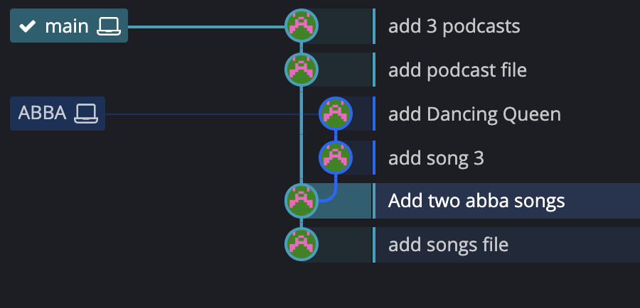
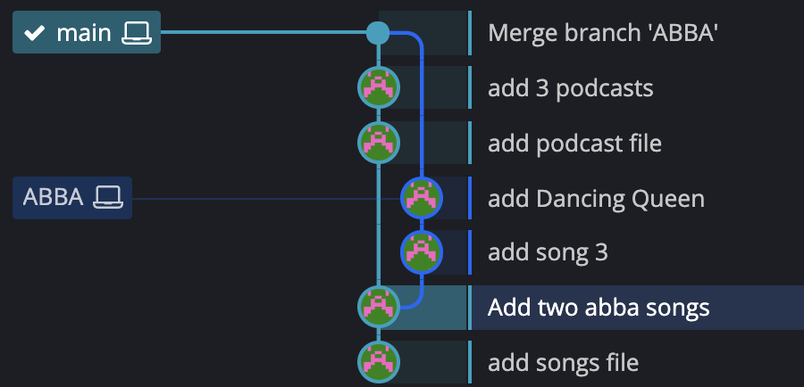

# Merge

#### Steps

1. Switch to or checkout the branch you want to merge the changes into
2. Use the `git merge` command to merge changes from a specific branch into the current branch


Some tips:

- We merge branches not specific commits.
- We always merge to current HEAD branch


### Fast forward merge

```shell
➜  RoadtripPlaylist git:(2000s) git switch main  
Switched to branch 'main'

➜  RoadtripPlaylist git:(main) git log

➜  RoadtripPlaylist git:(main) git merge 2000s
Updating 085fcce..79c3927
Fast-forward
 playlist.txt | 6 +++++-
 1 file changed, 5 insertions(+), 1 deletion(-)
```


### Merge commit without conflict

- e.g. changes in different files



```shell
➜  Playlist2 git:(main) git merge ABBA
Merge made by the 'ort' strategy.
 songs.txt | 4 +++-
 1 file changed, 3 insertions(+), 1 deletion(-)
```




### Merge Conflict

- e.g. changes on the same line in same files

```shell
➜  Playlist2 git:(combo) git merge bjorn
Auto-merging songs.txt
CONFLICT (content): Merge conflict in songs.txt
Automatic merge failed; fix conflicts and then commit the result.
```

```text
<<<<<<< HEAD
Song 1 -- ABBA
Song 2 -- ABBA
Song 3 -- ABBA
Dancing Queen -- ABBA
Give me Give me -- ABBA
Here you come again -- Dooly Partron
=======
Dancing Queen -- ABBA
Minimum Brain Size -- King Gizzard
songst -- Strokes
songst -- Strokes
>>>>>>> bjorn
```

#### Resolving conflicts

1. Open up the files with merge conflicts
2. Edit the files to remove the conflicts
3. Remove the conflict "markers" in the document
4. Add your changes and then make a commit (finishing the merging commit)


#### VSCode built-in conflict resolving

- Accept current change
- Accept incoming change
- Accept both changes
- Compare changes