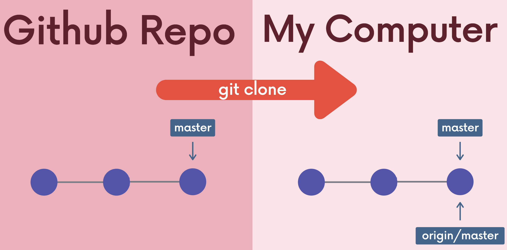
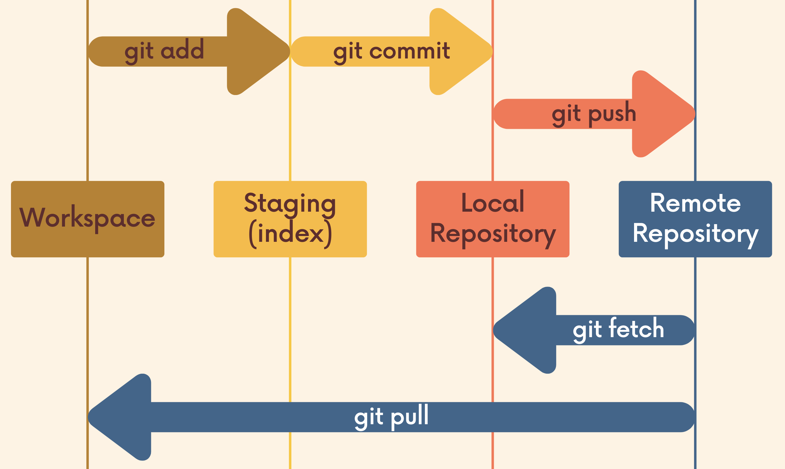

## Remote track branches




#### `git branch -r`

List remote branches --->  ==\<remote>/\<branch>== (e.g. origin/main)

```sh
  ➜  animals git:(main) git branch -r
  origin/HEAD -> origin/main
  origin/main
```

"As the time you last communicated with this remote repository, here is where branch was pointing"


#### Make local commit

- Your branch is ahead of 'origin/main' by 1 commit.

```sh
➜  animals git:(main) git status
On branch main
Your branch is ahead of 'origin/main' by 1 commit.
  (use "git push" to publish your local commits)
```


#### `git checkout origin/main`

- checkout(switch to) remote branch pointers
- In detached HEAD state


### Connect remote branch with local branch

#### `git switch <remote branch-name>`

- ==Create== a new local branch from the remote branch of the same name
- Old version: `git checkout --track <remote>/<branch> `

```sh
➜  remote-branches-demo git:(main) git switch asda
fatal: invalid reference: asda
➜  remote-branches-demo git:(main) git switch movies
branch 'movies' set up to track 'origin/movies'.
Switched to a new branch 'movies'
```


## Fetch



Fetching allows us to download changes from a remote repository, BUT those changes will not be automatically integrated (merge) into our working files.

#### `git fetch <remote>`

- Fetches branches and history from a specific remote repository.

- `git fetch` defaults to origin
- `git fetch <remote> <branch>` fetch from a specific branch

## Pull

Pulling retrieve changes from a remote repository and updates our HEAD branch with whatever changes are retrieved from the remote.

==git pull = git fetch + git merge==

#### `git pull <remote> <branch>`

- Just like `git merge`
  - It matters where we run this command from.
  - It can results in merge conflicts

#### `git pull`

- remote will default to origin
- Branch will default to whatever tracking connection is configured for your current branch.


| git fetch                                             | git pull                                               |
| ----------------------------------------------------- | ------------------------------------------------------ |
| Gets changes from remote branches                     | Gets changes from remote branches                      |
| Updates the remote-tracking changes, i.e. origin/main | Updates the current branch, merging them in, i.e. main |
| No merge                                              | Merge and conflicts                                    |
| Safe to do at anytime                                 | Not recommeded if you have uncommitted changes         |

