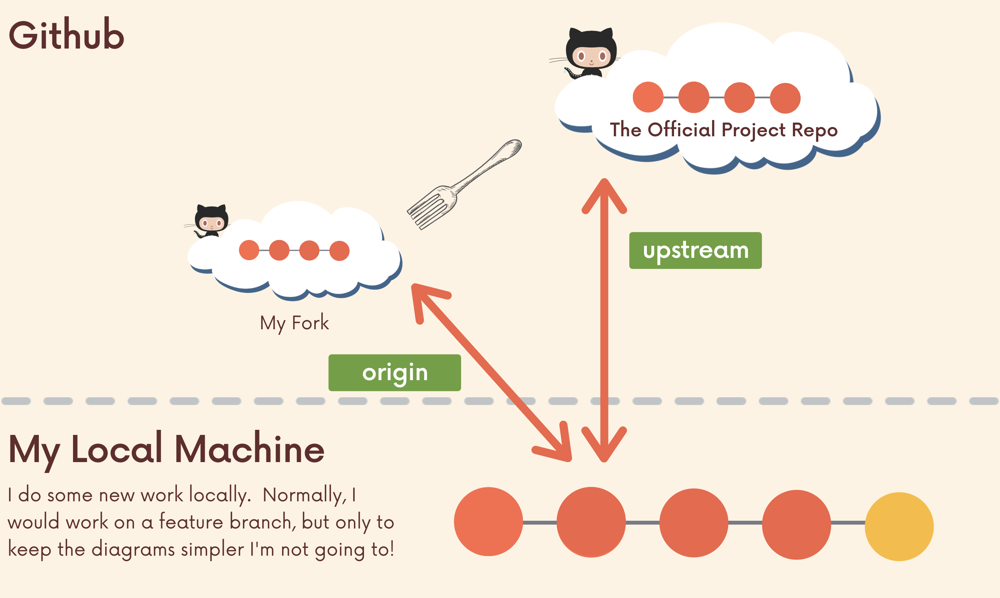

# Collaboration Workflow

## Centralized Workflow

---

Everyone works on the master branch.

- Lots of time spent solving confilicts and merging code
- No one can work on anything without disturbing the main codebase
- The only way to collaborate on a feature together is to push incomplete code to master


## Feature Branches

---

All new development should be done on seperate branches.

Treat main branch as the official project history.

#### Feature branch naming

Often you will see branch names that include slashes like bug/fix-scroll, feature/login-form

#### Merging in feature branches

1. Merge whenever you want
2. Email to discuss
3. **Pull Requests**


### Pull Requests

1. Do some work locally on a fetch branch
2. Push up the feature branch to Github
3. Open a ==Pull Request== using the feature branch just pushed up to Github
4. Wait for the PR to be approved and merged. Start a discussion on the PR.

Pull request --> add comment --> create pull request --> merge pull request

#### Merging pull requests with conflicts

```sh
# step 1: merge the main branch into my-new-feature branch
git fetch origin
git switch my-new-feature
git merge main
fix conflicts

#step 2: merge the resolved conflicts feature branch into main and push
git switch main
git merge --no--ff my-new-feature # no fast forward merge to create merging commit
git push origin main
```


#### Branch protect rules

Define branch protect rules to disable force push, prevent branches from deleted, and optionally require status check before merging.


## Fork & Clone

---

Github allow us to create perdonal copies of other people's repositories. We call those copies a ==fork== of the original.



#### Fork & Clone workflow

1. Fork the original project repo on Github
2. Clone my fork to local machine
   - `git clone <my forked repo>`
3. Add a remote pointing to the original project repo. This remote is often named ==upstream== (pull new changes if any)
   - `git remote add upstream <other's repo>`
4. Make changes and add/commit on a feature branch on my local machine
   - `git commit -am`
5. Push up new feature branch to my forked repo ==origin==
   - `git push origin <new-feature>`
6. Open a pull request to the original project repo containing the new work
7. Pull request is accepted or closed.
