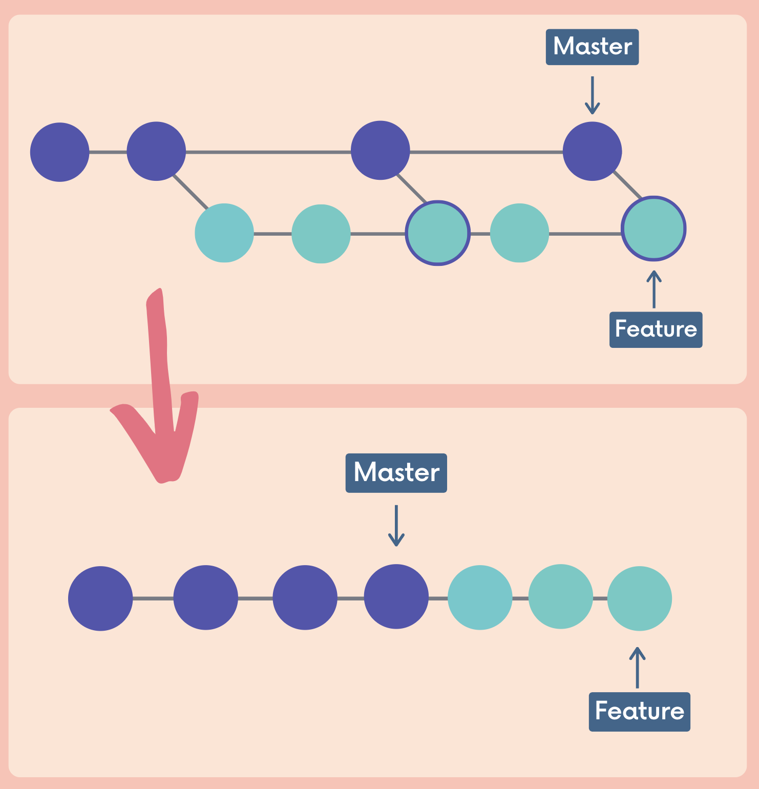

# Git Rebase

#### `git rebase <branch-name>`

> git-rebase - Reapply commits on top of another base tip

- as an alternative to `git merge`
  - Current at $feat$, run `git rebase main` --> change the $feat$ branch --> add all commits in $feat$ at the top of all commits in $main$, main branch is untouched
- as a cleanup tool

```sh
➜  RebaseDemo git:(feat) git rebase main
Successfully rebased and updated refs/heads/feat.
```



Instead of using a merging commit, rebasing ==rewrites history== by creating new commits for each of the original feature branch commits and add those new commits at the end of master branch.

- We get a much ==cleaner project history==. No unnecessary merge commits!
- We end up with a ==linear== project history.


#### Golden rules: when not to rebase

Never rebase commits that have been shared with others (already pushed). You do not want to rewrite any git history that other people already have.


#### Conflict in Rebasing

1. Resolve all conflicts manually
2. `git add <conflict files>`
3. `git rebase --continue`

OR

1. `git rebase absort `to get the status before