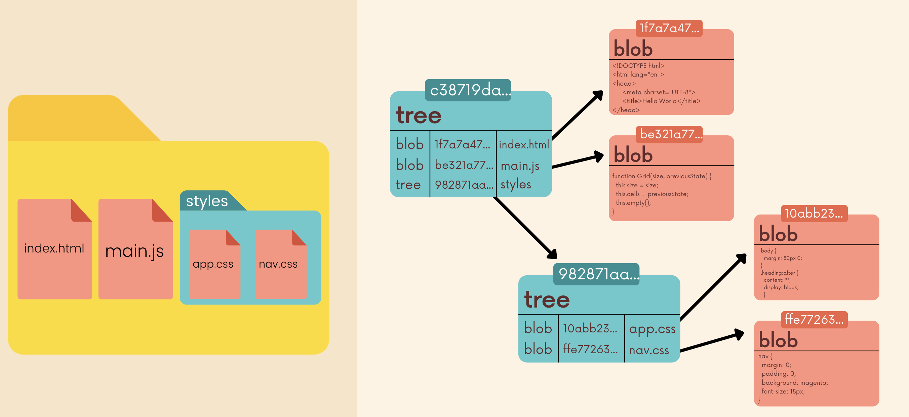

# Git behind the scene

## `.git` file

### config File

The config file is for configuration. Unlick global configm it configure things on a per-repo basis.

```
[core]
	repositoryformatversion = 0
	filemode = true
	bare = false
	logallrefupdates = true
	ignorecase = true
	precomposeunicode = true
[remote "origin"]
	url = https://github.com/facebook/react.git
	fetch = +refs/heads/*:refs/remotes/origin/*
[branch "main"]
	remote = origin
	merge = refs/heads/main
```

### refs Folder

- refs/heads contains one file per branch in a repository. Each file is named after a branch and contains the hash of the commit at the tip of the branch.
  - `main`, `feat`
- refs/tags contains one file for for each tag
- refs/remotes contains one folder for each remote, each remote has its own branch

### HEAD file

HEAD file is a text file that keeps track of where HEAD points.

```
refs/heaads/master
## OR ##
b2748907c3cffb226447417957f2608a7c60c27d
```

### Index file

Index file is a binary file that contains a list of the files the repository is tracking. It stores the file names as well as some metadata for each file but not store the actual contents of files.

### Objects Folder

The objects directory contains all the repo files. This is where Git stores the backups of files, the commits in a repo, and more.

The files are all compressed and encrypted.


#### 4 types of Git objects

- commit
- tree
- blob
- annotated tag


### Hashing Functions

Git uses a hashing function called ==SHA-1==

SHA-1 always generates 40-digit hexadecimal numbers

The commit hashes are the output of SHA-1


### Git Database

Git is a key-value data store. We can insert any kind of content into a Git repository, and Git will hand us back a unique key we can later use to retrieve that content.

These keys are SHA-1 checksums.

#### `git hash-object <file>`

The `git hash-object` command takes some data, stores in .git/objects directory and gives us back the unique SHA-1 hash.

```sh
➜  Object echo "hi" | git hash-object --stdin
45b983be36b73c0788dc9cbcb76cbb80fc7bb057
➜  Object echo "hi" | git hash-object --stdin
45b983be36b73c0788dc9cbcb76cbb80fc7bb057
```

- Output are the same
- `echo` simply repeats whatever we tell it to repeat.
- `--stdin` tells git hash-object to use the content from stdin rather than file

```sh
$ echo "hi" | git hash-object --stdin -w
ce013625030ba8dba906f756967f9e9ca394464a
```

- `-w` write the object to the database
- We can find the change in ==.git/objects==


#### `git cat-file`

Provide content or type and size information for repository objects

- `-p` print
- `-t` type
  - blob
  - tree
  - Commit

```sh
$ git cat-file -p ce013625030ba8dba906f756967f9e9ca394464a
hello
```

```sh
$ git hash-object dogs.txt -w

$ git cat-file -p 25030ba8 > dogs.txt
```


### Blobs

Git blobs(binary large object) are the object type Git uses to store the contents of files in a given repository. Blobs don't even include the filenames of each file.

### Trees

Trees are Git objects used to store the contents of a directory. Each tree contains pointers that can refer to blobs and to other trees. 

Each entry in a tree contains the SHA-1 hash of a blob or tree, as well as the mode, type, and filename.



List trees and blobs in the current pointer in main branch

```sh
➜  .git git:(main) git cat-file -p main^{tree}  
040000 tree 0a77c12ccb80520457fe55f3469dcdf85f7b6bb2    .circleci
040000 tree ee455b31da3561c3aec818359f774dcb01907388    .codesandbox
100644 blob 07552cfff88bafaf4d207e6255394bc6d6215302    .editorconfig
100644 blob 7d79ef692311259a6986aaa9160b1f6e7e795180    .eslintignore
100644 blob 0bc90137a5c7d2ad3e8a857943c24e43d7343dbd    .eslintrc.js
100644 blob 176a458f94e0ea5272ce67c36bf30b6be9caf623    .gitattributes

➜  .git git:(main) git cat-file -p b96dcb0480a0b0be0727976e5202a1e7b23edc3f
MIT License

Copyright (c) Facebook, Inc. and its affiliates.
```


### ==Commit==

Commit objects combine a tree object along with information about the context that led to the current tree.

Commit stores:

- A tree object
- A reference to parent commit
- the author
- the commiter
- commit message


#### First commit

```sh
### add/commit --> get the commit hash: 8b0a.....

➜  ObjectDemo git:(main) git cat-file -t 8b0ab5c288e90677c8461a8b0d2fe26d04ecc664
commit


➜  ObjectDemo git:(main) git cat-file -p 8b0ab5c288e90677c8461a8b0d2fe26d04ecc664
tree dfdd68291d4b3e8e5f02d3a6ec23f6f672c2f543
author Josh Wang <leotwang@bu.edu> 1663787660 -0400
committer Josh Wang <leotwang@bu.edu> 1663787660 -0400

initial commit
```

commit.tree

```sh
➜  ObjectDemo git:(main) git cat-file -t dfdd68291d4b3e8e5f02d3a6ec23f6f672c2f543
tree

➜  ObjectDemo git:(main) git cat-file -p dfdd68291d4b3e8e5f02d3a6ec23f6f672c2f543
100644 blob 496ee2ca6a2f08396a4076fe43dedf3dc0da8b6d    .gitignore
100644 blob fa634d3c165a4898f7a40f258c1ece17367c7c22    dogs.txt
```

tree.blob

```sh
➜  ObjectDemo git:(main) git cat-file -t 496ee2ca6a2f08396a4076fe43dedf3dc0da8b6d
blob

➜  ObjectDemo git:(main) git cat-file -p 496ee2ca6a2f08396a4076fe43dedf3dc0da8b6d
.DS_Store%    
```


#### Second commit: Add new file

```sh
➜  ObjectDemo git:(main) echo "meow meow" > cats.txt
➜  ObjectDemo git:(main) ✗ git add cats.txt 
➜  ObjectDemo git:(main) ✗ git commit -m "add cats file"

➜  ObjectDemo git:(main) git cat-file -p 5651e8b
tree 8efff4b42ae3f75b92160f56ccb6727b223656ba
parent 8b0ab5c288e90677c8461a8b0d2fe26d04ecc664
author Josh Wang <leotwang@bu.edu> 1663787988 -0400
committer Josh Wang <leotwang@bu.edu> 1663787988 -0400

add cats file
➜  ObjectDemo git:(main) git cat-file -p 8efff  
100644 blob 496ee2ca6a2f08396a4076fe43dedf3dc0da8b6d    .gitignore
100644 blob 6f6b544d1a3605ed85b3645784e2773e3564fc25    cats.txt
100644 blob fa634d3c165a4898f7a40f258c1ece17367c7c22    dogs.txt
```

The hashing for dogs.txt does ==not== change! -- `fa634d3`

As long as we do not change the file, git will not create a new blob.


#### ==What does git save==

Git does include for each commit a full copy of all the files, except that, for the content already present in the Git repo, the snapshot will simply point to said content rather than duplicate it.
That also means that several files with the same content are stored only once.

So a ==snapshot== is basically a commit, referring to the *content* of a directory structure.